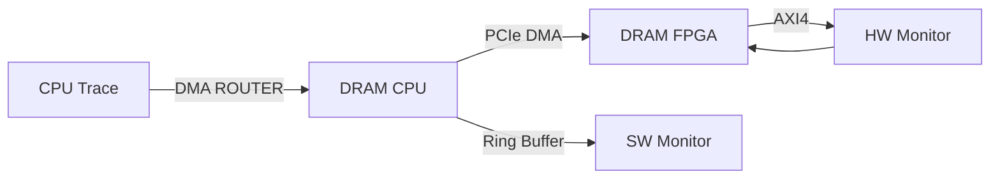

# rtmlib-ada


## Description

rtmlib-ada is a lean library (for Ada/SPARK2014) that supports atomic operations on shared memory circular buffers and implements a monitor abstraction layer for infinite sequences of time-stamped symbols or events.

The rtmlib-ada is not just yet another [rtmlib2](https://github.com/anmaped/rtmlib/tree/master) library (designed for Ada/SPARK2014 instead of C++11). It is an efficient library for embedded **safety-critical** systems with support for **hardware acceleration** for energy efficient monitoring. The rtmlib-ada can support software and hardware monitoring via dedicated CPU or FPGA devices.

This hybrid approach allows us to offload processor intensive monitors to the FPGA and connect CPU cores to the fabric monitor accelerators.



rtmlib-ada has a direct link to the rmtld3synth tool as a monitor integration layer. rmtld3synth is a tool that can automatically generate Ada/SPARK2014 monitors that can be implemented in software and hardware.


## Context

The RunTime embedded Monitoring Library (rtmlib) was originally developed for runtime monitoring of real-time embedded systems on ARM and X86 platforms [1] (current version also supports RISC-V), but without emphasis on safety-critical systems. This library is used to implement various monitoring architectures, such as those proposed in [2] and [3]. Other efficient architectures can be deployed based on lock-free push, pull, and pop primitives over infinite trace sequences containing time-stamped events. The synchronization primitives for push, pull, and pop operations allow different readers and writers to proceed asynchronously over the instantiated circular buffers and to synchronize on demand.


## How to use rtmlib-ada ?

See [examples](examples/) folder for more details. (more examples soon)


## Test rtmlib-ada

### Using Container (recommended)

The utilization of Podman/Buildah is necessary for building and running tests using containers.

Build and run unit tests with
```
podman build -f Containerfile -t rtmlib-ada-dev .
```

### Using Makefile

Use the `make` command to build the unit tests. It depends on GNAT 7 or above and other host libraries (see the Containerfile for more details on these dependencies!).

```
cd tests/
make
```

The expected output might be similar to
```
$ ./test_rtmlib
[...]

OK Test_Buffer : Test Buffer Push and Pop
OK Test_Buffer : Test Buffer Push and Pull
OK Test_Reader_Rmtld3 : Test Reader Rmtld3 Pull
OK Test_Rmtld3 : Test rmtld3 priimitives
OK Test_Rmtld3 : Test Proposition
OK Test_Rmtld3 : Test Or Formula
OK Test_Rmtld3 : Test Duration Term

Total Tests Run:   7
Successful Tests:  7
Failed Assertions: 0
Unexpected Errors: 0
$
```


## References

[1] de Matos Pedro, A., Pinto, J.S., Pereira, D. et al. Runtime verification of autopilot systems using a fragment of MTL-∫ . Int J Softw Tools Technol Transfer 20, 379–395 (2018). https://doi.org/10.1007/s10009-017-0470-5

[2] Nelissen G., Pereira D., Pinho L.M. (2015) A Novel Run-Time Monitoring Architecture for Safe and Efficient Inline Monitoring. In: de la Puente J., Vardanega T. (eds) Reliable Software Technologies – Ada-Europe 2015. Ada-Europe 2015. Lecture Notes in Computer Science, vol 9111. Springer, Cham. https://doi.org/10.1007/978-3-319-19584-1_5

[3] de Matos Pedro A., Pereira D., Pinho L.M., Pinto J.S. (2014) Towards a Runtime Verification Framework for the Ada Programming Language. In: George L., Vardanega T. (eds) Reliable Software Technologies – Ada-Europe 2014. Ada-Europe 2014. Lecture Notes in Computer Science, vol 8454. Springer, Cham. https://doi.org/10.1007/978-3-319-08311-7_6
